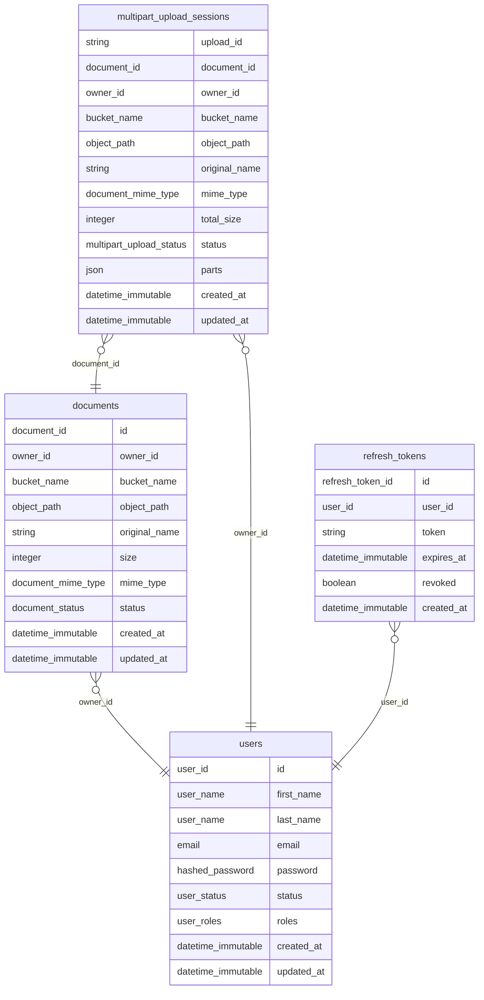

# Entity Relation Diagram

```mermaid
erDiagram
    documents {
        document_id id
        owner_id owner_id
        bucket_name bucket_name
        object_path object_path
        string original_name
        integer size
        document_mime_type mime_type
        document_status status
        datetime_immutable created_at
        datetime_immutable updated_at
    }
    multipart_upload_sessions {
        string upload_id
        document_id document_id
        owner_id owner_id
        bucket_name bucket_name
        object_path object_path
        string original_name
        document_mime_type mime_type
        integer total_size
        multipart_upload_status status
        json parts
        datetime_immutable created_at
        datetime_immutable updated_at
    }
    refresh_tokens {
        refresh_token_id id
        user_id user_id
        string token
        datetime_immutable expires_at
        boolean revoked
        datetime_immutable created_at
    }
    users {
        user_id id
        user_name first_name
        user_name last_name
        email email
        hashed_password password
        user_status status
        user_roles roles
        datetime_immutable created_at
        datetime_immutable updated_at
    }
    documents }o--|| users : "owner_id"
    multipart_upload_sessions }o--|| documents : "document_id"
    multipart_upload_sessions }o--|| users : "owner_id"
    refresh_tokens }o--|| users : "user_id"
```
