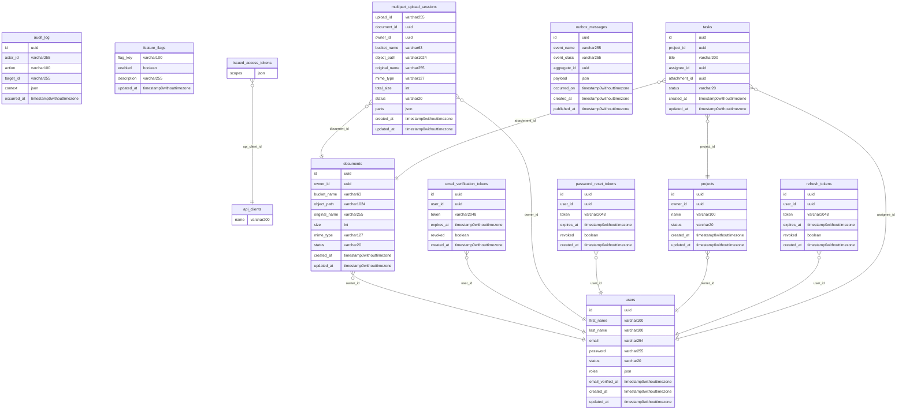

# Entity Relation Diagram

```mermaid
erDiagram
    api_clients {
        name varchar200
    }
    audit_log {
        id uuid
        actor_id varchar255
        action varchar100
        target_id varchar255
        context json
        occurred_at timestamp0withouttimezone
    }
    documents {
        id uuid
        owner_id uuid
        bucket_name varchar63
        object_path varchar1024
        original_name varchar255
        size int
        mime_type varchar127
        status varchar20
        created_at timestamp0withouttimezone
        updated_at timestamp0withouttimezone
    }
    email_verification_tokens {
        id uuid
        user_id uuid
        token varchar2048
        expires_at timestamp0withouttimezone
        revoked boolean
        created_at timestamp0withouttimezone
    }
    feature_flags {
        flag_key varchar100
        enabled boolean
        description varchar255
        updated_at timestamp0withouttimezone
    }
    issued_access_tokens {
        scopes json
    }
    multipart_upload_sessions {
        upload_id varchar255
        document_id uuid
        owner_id uuid
        bucket_name varchar63
        object_path varchar1024
        original_name varchar255
        mime_type varchar127
        total_size int
        status varchar20
        parts json
        created_at timestamp0withouttimezone
        updated_at timestamp0withouttimezone
    }
    outbox_messages {
        id uuid
        event_name varchar255
        event_class varchar255
        aggregate_id uuid
        payload json
        occurred_on timestamp0withouttimezone
        created_at timestamp0withouttimezone
        published_at timestamp0withouttimezone
    }
    password_reset_tokens {
        id uuid
        user_id uuid
        token varchar2048
        expires_at timestamp0withouttimezone
        revoked boolean
        created_at timestamp0withouttimezone
    }
    projects {
        id uuid
        owner_id uuid
        name varchar100
        status varchar20
        created_at timestamp0withouttimezone
        updated_at timestamp0withouttimezone
    }
    refresh_tokens {
        id uuid
        user_id uuid
        token varchar2048
        expires_at timestamp0withouttimezone
        revoked boolean
        created_at timestamp0withouttimezone
    }
    tasks {
        id uuid
        project_id uuid
        title varchar200
        assignee_id uuid
        attachment_id uuid
        status varchar20
        created_at timestamp0withouttimezone
        updated_at timestamp0withouttimezone
    }
    users {
        id uuid
        first_name varchar100
        last_name varchar100
        email varchar254
        password varchar255
        status varchar20
        roles json
        email_verified_at timestamp0withouttimezone
        created_at timestamp0withouttimezone
        updated_at timestamp0withouttimezone
    }
    documents }o--|| users : "owner_id"
    email_verification_tokens }o--|| users : "user_id"
    issued_access_tokens }o--|| api_clients : "api_client_id"
    multipart_upload_sessions }o--|| documents : "document_id"
    multipart_upload_sessions }o--|| users : "owner_id"
    password_reset_tokens }o--|| users : "user_id"
    projects }o--|| users : "owner_id"
    refresh_tokens }o--|| users : "user_id"
    tasks }o--|| documents : "attachment_id"
    tasks }o--|| projects : "project_id"
    tasks }o--|| users : "assignee_id"
```
