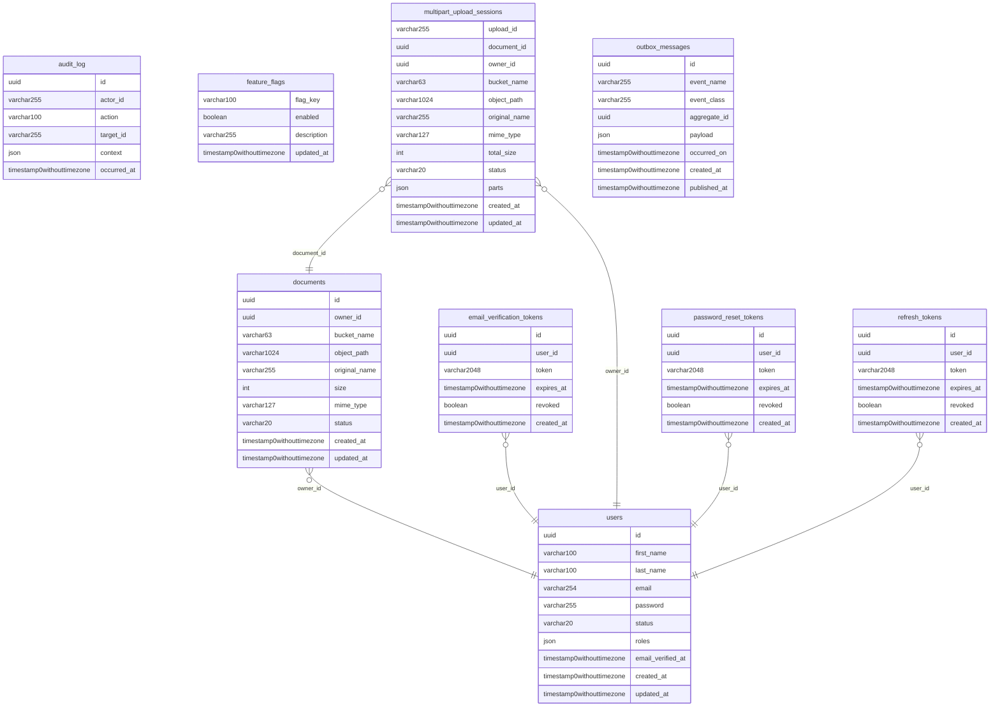

# Entity Relation Diagram

```mermaid
erDiagram
    audit_log {
        uuid id
        varchar255 actor_id
        varchar100 action
        varchar255 target_id
        json context
        timestamp0withouttimezone occurred_at
    }
    documents {
        uuid id
        uuid owner_id
        varchar63 bucket_name
        varchar1024 object_path
        varchar255 original_name
        int size
        varchar127 mime_type
        varchar20 status
        timestamp0withouttimezone created_at
        timestamp0withouttimezone updated_at
    }
    email_verification_tokens {
        uuid id
        uuid user_id
        varchar2048 token
        timestamp0withouttimezone expires_at
        boolean revoked
        timestamp0withouttimezone created_at
    }
    feature_flags {
        varchar100 flag_key
        boolean enabled
        varchar255 description
        timestamp0withouttimezone updated_at
    }
    multipart_upload_sessions {
        varchar255 upload_id
        uuid document_id
        uuid owner_id
        varchar63 bucket_name
        varchar1024 object_path
        varchar255 original_name
        varchar127 mime_type
        int total_size
        varchar20 status
        json parts
        timestamp0withouttimezone created_at
        timestamp0withouttimezone updated_at
    }
    outbox_messages {
        uuid id
        varchar255 event_name
        varchar255 event_class
        uuid aggregate_id
        json payload
        timestamp0withouttimezone occurred_on
        timestamp0withouttimezone created_at
        timestamp0withouttimezone published_at
    }
    password_reset_tokens {
        uuid id
        uuid user_id
        varchar2048 token
        timestamp0withouttimezone expires_at
        boolean revoked
        timestamp0withouttimezone created_at
    }
    refresh_tokens {
        uuid id
        uuid user_id
        varchar2048 token
        timestamp0withouttimezone expires_at
        boolean revoked
        timestamp0withouttimezone created_at
    }
    users {
        uuid id
        varchar100 first_name
        varchar100 last_name
        varchar254 email
        varchar255 password
        varchar20 status
        json roles
        timestamp0withouttimezone email_verified_at
        timestamp0withouttimezone created_at
        timestamp0withouttimezone updated_at
    }
    documents }o--|| users : "owner_id"
    email_verification_tokens }o--|| users : "user_id"
    multipart_upload_sessions }o--|| documents : "document_id"
    multipart_upload_sessions }o--|| users : "owner_id"
    password_reset_tokens }o--|| users : "user_id"
    refresh_tokens }o--|| users : "user_id"
```
